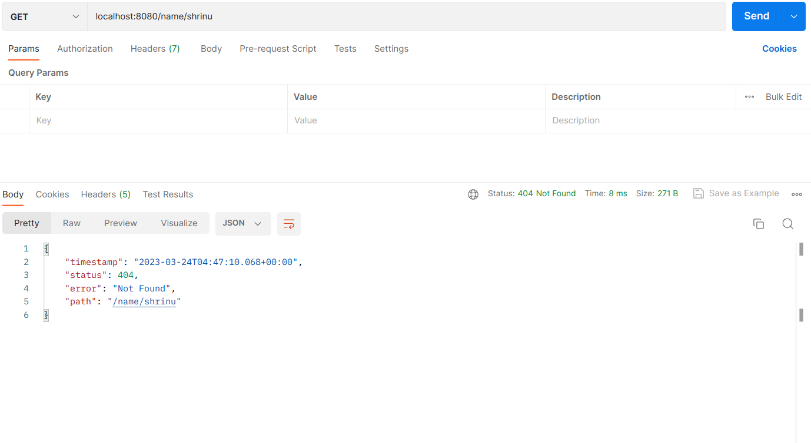
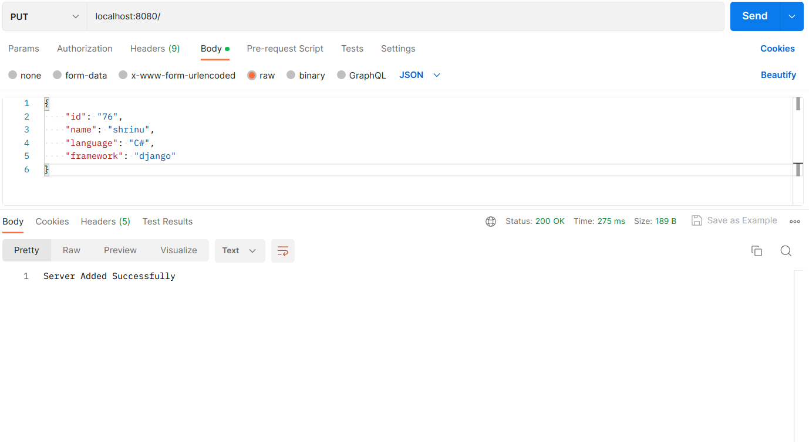

# Server API

This is a Java application that provides a REST API with endpoints for searching, creating and deleting "server" objects. Spring web framework and a mongodb server are used in this project to provide this API.

Project developed as part of an assignment by Kaiburr.

## Table of contents
- Usage
- Endpoints
- Examples

## Installation
1. Download **server.jar** file into your local repository and cd into it
2. Make sure you have jdk 19 and mongodb 6 installed on your machine
3. start mongodb on your machine. On linux that would be using:
    > sudo sytemctl start mongod
4. run **server.jar** file

## Usage
 Use **postman** to get, post and delete

## Endpoints
- GET **'/'** - returns all server objects as json
- GET **'/{id}'** - returns the server object that matches that id else returns a 404
- GET **'/name/{name}'** - returns all server objects with names that contain the {name} string, else returns a 404
- PUT **'/'** - takes in a JSON encoded message body and stores it in a mongodb server
- DELETE **'/{id}'** - deletes the serves that the has {id} as its id

## Examples
Examples of the API using **Postman**
- GET **'/'** :
  
- GET **'/{id}'** :
  - when id is found:
      
  - when id is not found:
      
- GET **'/name/{name}'** :
  - when name is found:
      
  - when name is not found:
      
- PUT **'/'**: 
   
- DELETE **'/{id}'**:
   